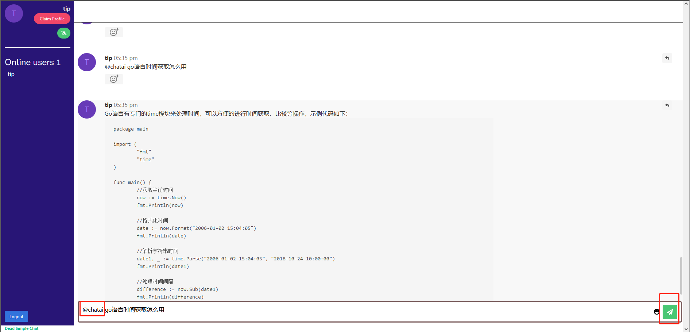

## 使用

访问聊天室首页
```
http://localhost:38080/
```

在聊天框输入文本 @chatai xxx,内部调用openai接口进行完善应答
```
@chatai + 问题
```

## 参考
- [go ws 聊天室](https://deadsimplechat.com/blog/golang-websocket-chat-server/)
- [deadsimplechat 申请聊天房间](https://deadsimplechat.com/)
- [chatgpt-dingtalk](https://github.com/eryajf/chatgpt-dingtalk)